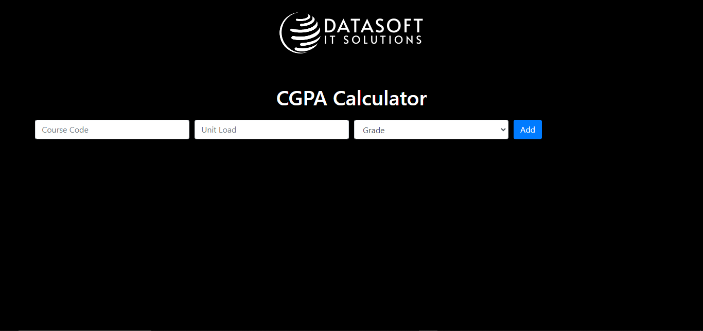

#
<p align="center">	
   <a href="https://www.linkedin.com/in/princexz">
      
   </a>
  <a href="https://github.com/princexz/Quiz-Application/blob/main/License">
    
  </a>
  
  


</p>
#
* Application: CGPA Calculator
* Author: Prince Solomon
* Year: 2024.


* This Application help student to calculate their Result
  
 * Application Version v5.0.0 (https://github.com/princexz)
 * Copyright 2024 The Application Author
 * Licensed under MIT (https://github.com/princexz/  CGP_Calculator/blob/master/LICENSE)


<div align="center">

</div>

 
 # CGPA APPLICATION.

In this tutorial we deploy the chatbot I created in [this](https://github.com/python-engineer/pytorch-chatbot) tutorial with Flask and JavaScript.

This gives 2 deployment options:
- Deploy within Flask app with jinja2 template
- Serve only the Flask prediction API. The used html and javascript files can be included in any Frontend application (with only a slight modification) and can run completely separate from the Flask App then.

## Initial Setup:
This repo currently contains the starter files.

Clone repo and create a virtual environment
```
$ git clone https://github.com/princexz/CGP-Calculator.git
$ cd CGP-Calculator-deployment
$ -m venv venv
$ . venv/bin/activate
```
Install dependencies
```
$ (venv) pip install Flask torch torchvision nltk
```
Install nltk package
```
$ (venv) IDE VS Code
>>> import nltk
>>> nltk.download('punkt')
```

Run
```
$ (Index) index.html
```
This will dump data.pth file. And then run
the following command to test it in the console.
```
```

# 📝 Features 
✅ This is a CGPA-CALCULATOR application website. <br>
✅ It help Student in Calculate their  CGPA . 

# 💻 Technologies used


# 👩‍💻 IDE used


# 🌐 Visit the website here
https://princexz.github.io/CGP-Calculator/

# 📕 License
This project is under <a href="https://github.com/princexz/Quiz-Application/blob/main/LICENSE">MIT</a> license.

## Credits:
https://github.com/princexz/CGP-Calculator
